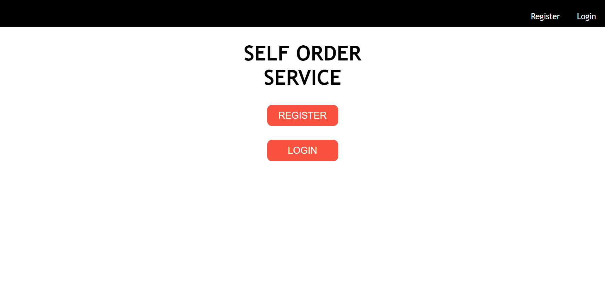
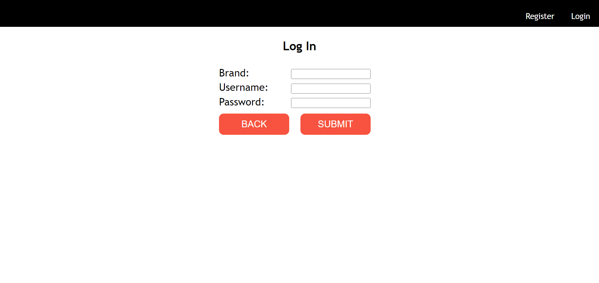
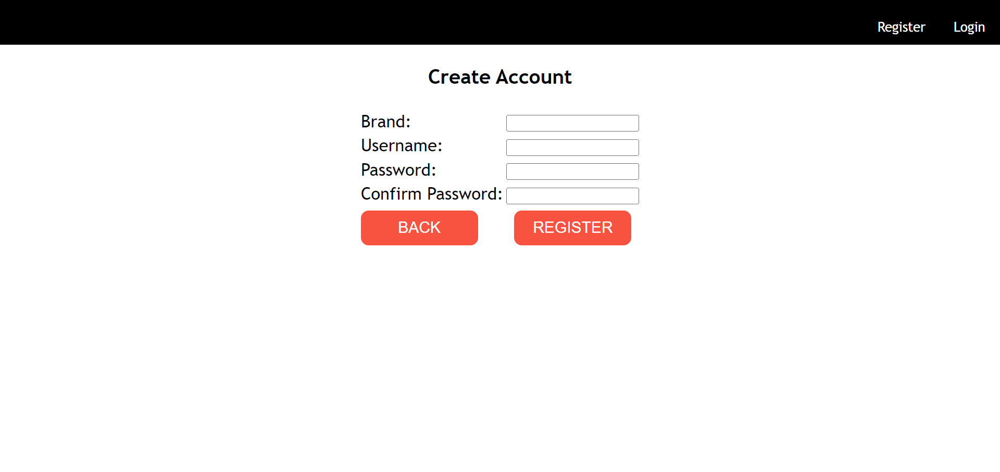
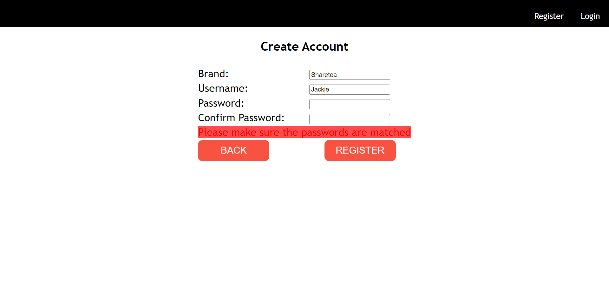
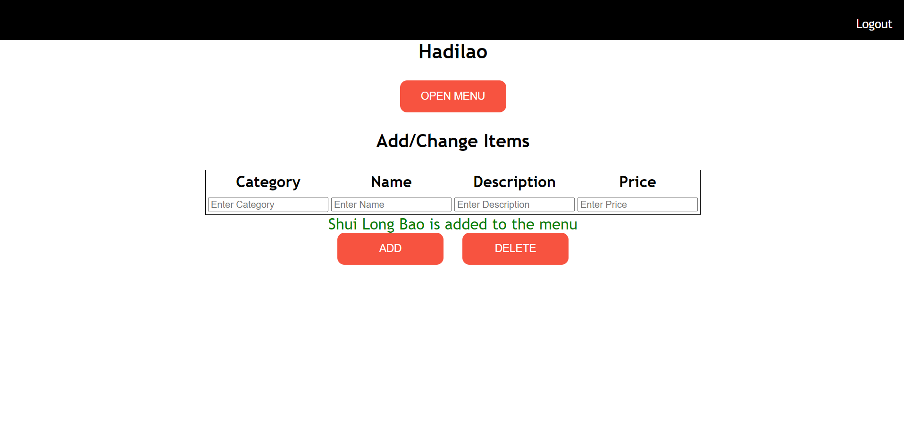
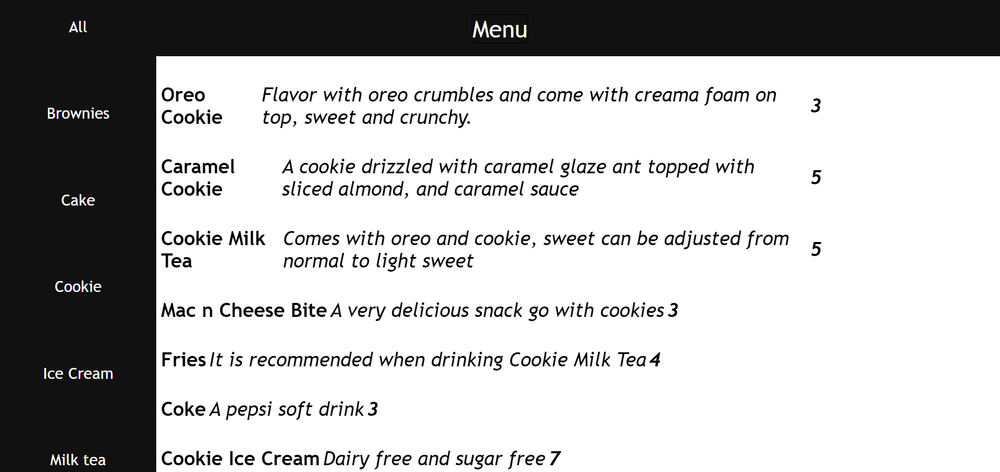

<h1 align="center"> &nbsp;&nbsp;MENU MANAGEMENT SERVICE   (DUBHACKS'22 CONNECTIVITY TRACK) </h1>

<h2 align="center"> AUTHOR: LE THIEN AN TRAN, LE DUY AN TRAN, ADALBERTO ACOSTA </h2>

 

<h3> ABOUT IT </h3> 

This is a web app that can be used in kiosk, and online website. The user will probably be an owner of a restaurant, boba shop, or any stores. This web app will allows
 and help the user organize their menu and display menu to the customer on the kiosk or online website.
   

<h3> FEATURES & SPECIAL FEATURES </h3>
Features: 
<ol>
    <li> The user will have an option to create their account with their <em><strong> brand name</strong></em>, <em><strong> username</strong></em>, and <em><strong>password</strong></em>.</li>
  <li> User can <em><strong>make changes</strong></em> to the menu/services they want to update to the display. </li>
  <li> After <em><strong>updates</strong></em> the menu/services, users can open the menu/services directory in order to start displaying their menu/services to the customers so that the customers can view their 
      menu/services. </li>
  <li> Each user <em><strong>has their own database </strong></em>so don't worry about people can get access and make change to the settings or accidentally access to other stores' database. </li>
</ol>
 Special Features:
 <ul>
  <li> Rating Button (<em><strong>Recommendation will be automatically display</strong></em> to the customers through the number of times that customer order, providing information of <em><strong>low-sales items</strong></em> so 
    user/owner can easily act <em><strong>a better business strategy</em></strong>).</li>
  <li> Sales Summary (<em><strong>Option</strong></em> to get daily, monthly, and quarterly report of sales). </li>
  <li> Order System (User/Owner have option to let the user <em><strong>order or only viewing the menu/services</strong></em>). </li>
</ul>
<h3> UPDATES/COMING SOON </h3>
<ul>
  <li> Rating Button </li>
  <li> Sales Summary </li>
  <li> Order System </li>
  <li> Updates on UX/UI </li> 
</ul> 
<h3> TOOLS </h3>
<ul>
<li> ASP.NET </li>
<li> SQL SERVER </li>
<li> Visual Studio 2022 </li> 
<li> CSS </li>
</ul>
<h3> WebApp Images </h3> 
<h2 align="center"> Login Account For User/Owner </h2>

<h2 align="center"> Create Account For User/Owner </h2>

<h2 align="center"> User/Owner Home - Make Changes To Menu

  <h2 align="center"> Display To Customer </h2>
  
